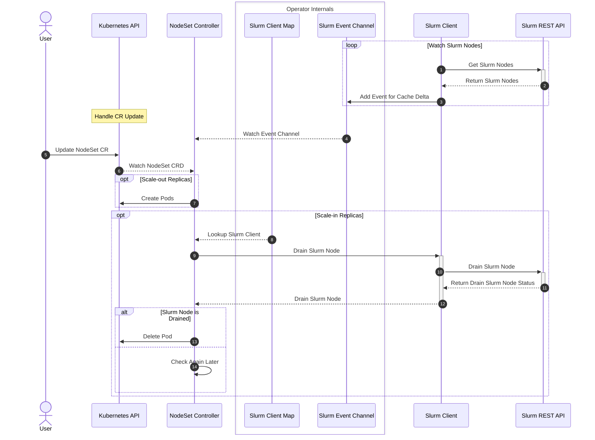

# NodeSet Controller

## Table of Contents

<!-- mdformat-toc start --slug=github --no-anchors --maxlevel=6 --minlevel=1 -->

- [NodeSet Controller](#nodeset-controller)
  - [Table of Contents](#table-of-contents)
  - [Overview](#overview)
  - [Design](#design)
    - [Sequence Diagram](#sequence-diagram)

<!-- mdformat-toc end -->

## Overview

The nodeset controller is responsible for managing and reconciling the NodeSet
CRD, which represents a set of homogeneous Slurm Nodes.

## Design

This controller is responsible for managing and reconciling the NodeSet CRD. In
addition to the regular responsibility of managing resources in Kubernetes via
the Kubernetes API, this controller should take into consideration the state of
Slurm to make certain reconciliation decisions.

### Sequence Diagram

### UseNodeNameAsHostname

When `spec.useNodeNameAsHostname` is enabled on a NodeSet, the controller
ensures each pod's hostname matches the Kubernetes node name it runs on. Because
Kubernetes only allows setting `spec.hostname` at pod creation time and the node
is only known after scheduling, the controller uses a two-phase approach:

1. Pods are created without a fixed hostname and are scheduled normally by the
   Kubernetes scheduler.
2. Once a pod is placed on a node, the controller detects when the pod hostname
   does not match the node name. It then deletes the pod and recreates it on the
   same node with `spec.hostname` and `spec.nodeName` both set to the
   scheduler-chosen node name.

This keeps scheduling decisions with the Kubernetes scheduler while allowing
Slurm node names to align with physical or virtual machine names (e.g. for
hostname-based resolution or topology).