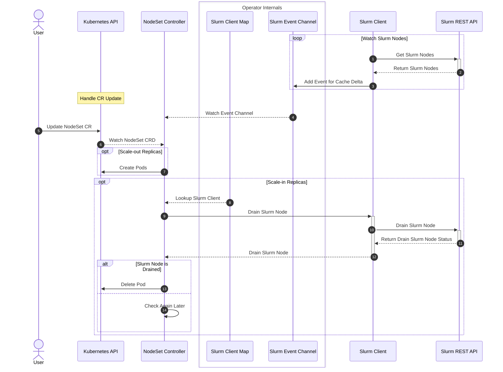

# NodeSet Controller

## Table of Contents

<!-- mdformat-toc start --slug=github --no-anchors --maxlevel=6 --minlevel=1 -->

- [NodeSet Controller](#nodeset-controller)
  - [Table of Contents](#table-of-contents)
  - [Overview](#overview)
  - [Design](#design)
    - [Node Locking](#node-locking)
    - [Sequence Diagram](#sequence-diagram)

<!-- mdformat-toc end -->

## Overview

The nodeset controller is responsible for managing and reconciling the NodeSet
CRD, which represents a set of homogeneous Slurm Nodes.

## Design

This controller is responsible for managing and reconciling the NodeSet CRD. In
addition to the regular responsibility of managing resources in Kubernetes via
the Kubernetes API, this controller should take into consideration the state of
Slurm to make certain reconciliation decisions.

### Node Locking

When `lockNodes` is enabled on a NodeSet, the controller tracks which Kubernetes
node each worker pod is assigned to in `status.nodeAssignments`. On pod
recreation, a `requiredDuringSchedulingIgnoredDuringExecution` NodeAffinity is
injected to pin the pod to its previously assigned node. If `lockNodeLifetime`
is set to a positive value, the assignment expires after that many seconds of
the pod not running, allowing the pod to reschedule freely. See
[Workload Isolation](../usage/workload-isolation.md#node-locking) for usage
details.

### Sequence Diagram

