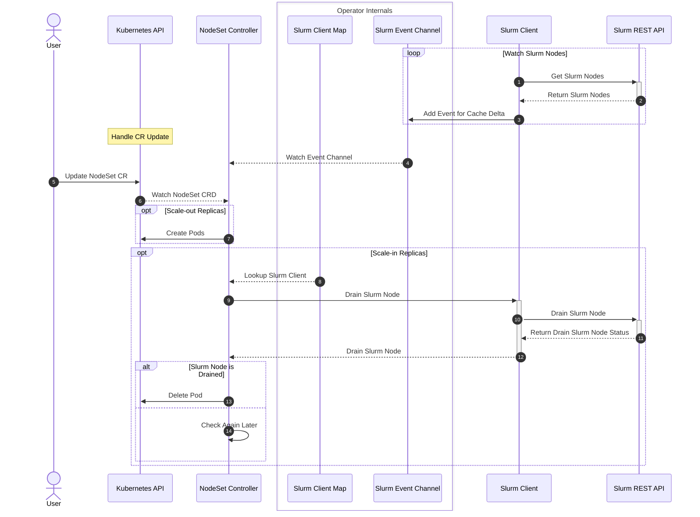

# NodeSet Controller

## Table of Contents

<!-- mdformat-toc start --slug=github --no-anchors --maxlevel=6 --minlevel=1 -->

- [NodeSet Controller](#nodeset-controller)
  - [Table of Contents](#table-of-contents)
  - [Overview](#overview)
  - [Design](#design)
    - [Sequence Diagram](#sequence-diagram)
  - [Drain and Cordon](#drain-and-cordon)
    - [Kubernetes to Slurm (K8s → Slurm)](#kubernetes-to-slurm-k8s--slurm)
    - [Slurm to Kubernetes (Slurm → K8s)](#slurm-to-kubernetes-slurm--k8s)
    - [Priority](#priority)
    - [Loop Prevention](#loop-prevention)
  - [Well-Known Annotations](#well-known-annotations)
    - [Pod Annotations](#pod-annotations)
    - [Node Annotations](#node-annotations)

<!-- mdformat-toc end -->

## Overview

The nodeset controller is responsible for managing and reconciling the NodeSet
CRD, which represents a set of homogeneous Slurm Nodes.

## Design

This controller is responsible for managing and reconciling the NodeSet CRD. In
addition to the regular responsibility of managing resources in Kubernetes via
the Kubernetes API, this controller should take into consideration the state of
Slurm to make certain reconciliation decisions.

### Sequence Diagram

## Drain and Cordon

The NodeSet controller synchronizes drain state **bidirectionally** between
Kubernetes and Slurm. Draining a node on either side is reflected on the other.

### Kubernetes to Slurm (K8s → Slurm)

When a Kubernetes node is cordoned (`kubectl cordon <node>`), the operator
cordons each NodeSet pod on that node (`pod-cordon: "true"`,
`pod-cordon-source: "operator"`) and drains the corresponding Slurm node.

When the node is uncordoned (`kubectl uncordon <node>`), the operator removes
the pod cordon annotations and undrains the Slurm node.

The same flow applies when `pod-cordon` is set directly on a NodeSet pod.

A custom Slurm drain reason can be provided via the `node-cordon-reason`
annotation on the Kubernetes node. If updated while already cordoned, the
operator propagates the new reason to Slurm on the next reconciliation.

### Slurm to Kubernetes (Slurm → K8s)

When a Slurm node is drained externally (e.g.
`scontrol update node=<name> state=drain reason="maintenance"`), the operator
cordons the Kubernetes node, sets `node-cordon-source: "slurm"` and
`node-cordon-reason` on the node, and marks the pod (`pod-cordon: "true"`,
`pod-cordon-source: "slurm"`, `pod-cordon-reason`).

When the Slurm node is undrained externally, the operator uncordons the
Kubernetes node, removes all node and pod cordon annotations.

The operator distinguishes external drains from its own by the Slurm reason
prefix `slurm-operator:`.

### Priority

Kubernetes node cordon has **higher priority** than Slurm drain. When both
exist, the Kubernetes reason wins. Running `scontrol resume` while the node is
cordoned has no lasting effect — the operator re-drains on the next
reconciliation. To fully undrain, uncordon the Kubernetes node first.

External Slurm drains are only processed when the Kubernetes node is **not**
independently cordoned.

### Loop Prevention

The `pod-cordon-source` annotation prevents infinite loops:

- Source `"operator"` → K8s-initiated; Slurm is re-drained every reconciliation
  while the node stays cordoned. When the node is uncordoned, the operator
  cleans up pod annotations and undrains Slurm.
- Source `"slurm"` → Slurm-initiated; the operator does **not** re-drain Slurm.
  The node cordon set by the operator is also recognized as Slurm-originated.
  When Slurm is undrained, the operator removes annotations and uncordons the
  node.

## Well-Known Annotations

### Pod Annotations

| Annotation | Value | Description |
|---|---|---|
| `pod-cordon` | `"true"` | Marks the pod for Slurm node drain. |
| `pod-cordon-source` | `"operator"` / `"slurm"` | Origin of the cordon. `"operator"` = K8s-initiated (higher priority). `"slurm"` = external Slurm drain. |
| `pod-cordon-reason` | string | Drain reason associated with the pod cordon. Set for all cordon sources (Slurm drains, K8s-initiated cordons, scale-in). |
| `pod-deletion-cost` | integer | Pod deletion order during scale-in. Lower cost deleted first. |
| `pod-deadline` | RFC 3339 timestamp | Expected workload completion time. Earlier deadlines preferred for deletion. |

All pod annotations use the `nodeset.slinky.slurm.net/` prefix.

### Node Annotations

| Annotation | Value | Description |
|---|---|---|
| `node-cordon-reason` | string | K8s → Slurm: user-set custom drain reason. Slurm → K8s: operator-set Slurm drain reason. |
| `node-cordon-source` | `"slurm"` | Present when the operator cordoned the node due to an external Slurm drain. |
| `line` | string | Slurm dynamic topology line (e.g. `"topo-switch:s2,topo-block:b2"`). See [Topology](../usage/topology.md). |

Node cordon annotations use the `nodeset.slinky.slurm.net/` prefix.
The `line` annotation uses the `topology.slinky.slurm.net/` prefix.
