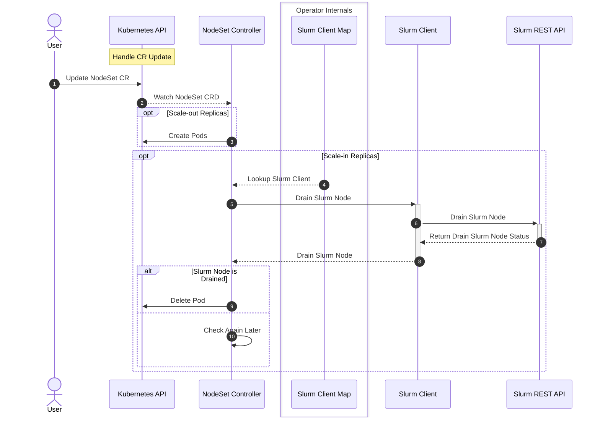
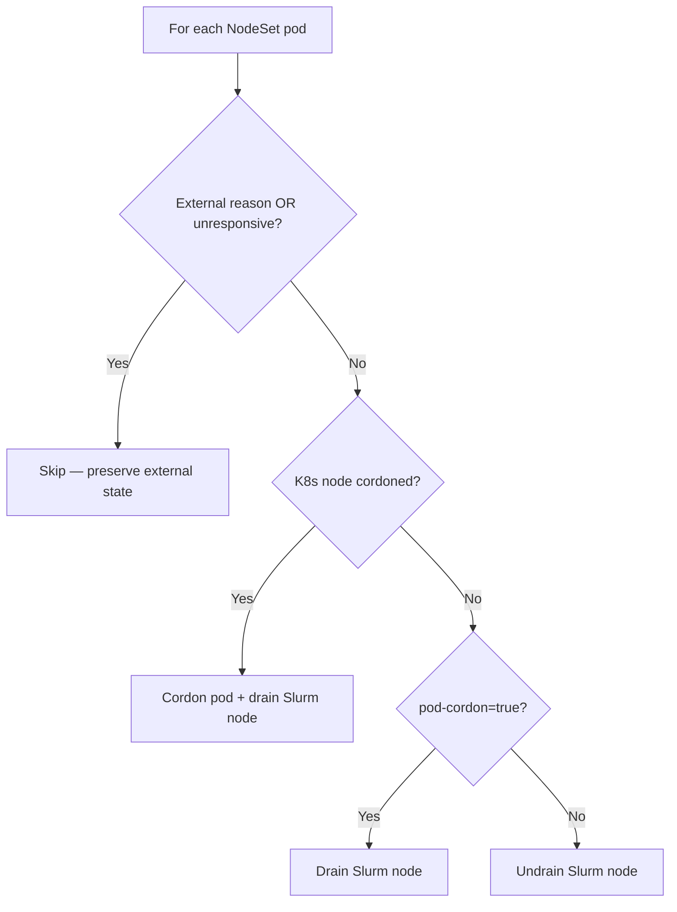

# NodeSet Controller

## Table of Contents

<!-- mdformat-toc start --slug=github --no-anchors --maxlevel=6 --minlevel=1 -->

- [NodeSet Controller](#nodeset-controller)
  - [Table of Contents](#table-of-contents)
  - [Overview](#overview)
  - [Design](#design)
    - [Node Locking](#node-locking)
    - [Sequence Diagram](#sequence-diagram)
    - [Slurm Node State Visibility](#slurm-node-state-visibility)
    - [Drain and Cordon Design](#drain-and-cordon-design)
    - [Scale-in Lifecycle](#scale-in-lifecycle)

<!-- mdformat-toc end -->

## Overview

The nodeset controller is responsible for managing and reconciling the NodeSet
CRD, which represents a set of homogeneous Slurm Nodes.

## Design

This controller is responsible for managing and reconciling the NodeSet CRD. In
addition to the regular responsibility of managing resources in Kubernetes via
the Kubernetes API, this controller should take into consideration the state of
Slurm to make certain reconciliation decisions.

### Node Locking

When `lockNodes` is enabled on a NodeSet, the controller tracks which Kubernetes
node each worker pod is assigned to in `status.nodeAssignments`. On pod
recreation, a `requiredDuringSchedulingIgnoredDuringExecution` NodeAffinity is
injected to pin the pod to its previously assigned node. If `lockNodeLifetime`
is set to a positive value, the assignment expires after that many seconds of
the pod not running, allowing the pod to reschedule freely. See
[Workload Isolation](../usage/workload-isolation.md#node-locking) for usage
details.

### Sequence Diagram

### Slurm Node State Visibility

The operator projects Slurm node states onto Kubernetes pod conditions so that
external tools can observe Slurm state without querying the Slurm REST API
directly. Every condition type uses the prefix `SlurmNodeState`.

**Base states** — exactly one is active at a time:

| Condition Type            | Slurm State |
| ------------------------- | ----------- |
| `SlurmNodeStateAllocated` | Allocated   |
| `SlurmNodeStateDown`      | Down        |
| `SlurmNodeStateError`     | Error       |
| `SlurmNodeStateFuture`    | Future      |
| `SlurmNodeStateIdle`      | Idle        |
| `SlurmNodeStateMixed`     | Mixed       |
| `SlurmNodeStateUnknown`   | Unknown     |

**Flag states** — combinable with base states:

| Condition Type                | Slurm Flag    |
| ----------------------------- | ------------- |
| `SlurmNodeStateCompleting`    | Completing    |
| `SlurmNodeStateDrain`         | Drain         |
| `SlurmNodeStateFail`          | Fail          |
| `SlurmNodeStateInvalid`       | Invalid       |
| `SlurmNodeStateInvalidReg`    | InvalidReg    |
| `SlurmNodeStateMaintenance`   | Maintenance   |
| `SlurmNodeStateNotResponding` | NotResponding |
| `SlurmNodeStateUndrain`       | Undrain       |

The `.Message` field on the `SlurmNodeStateDrain` condition carries the Slurm
drain reason string.

**Conceptual states** derived from condition combinations:

- **Busy** — the node is running work: `Allocated`, `Mixed`, or `Completing` is
  `True`.
- **Drain** — the node has the drain flag set: `Drain` is `True` AND `Undrain`
  is not `True`.
- **Drained** — drain is complete: `Drain` AND NOT `Busy`.
- **Draining** — drain is in progress: `Drain` AND `Busy`.

### Drain and Cordon Design

The operator implements a unidirectional Kubernetes-to-Slurm cordon model.
Cordoning a Kubernetes node or annotating a pod triggers a Slurm drain;
uncordoning reverses it. The operator never initiates a cordon on its own — it
only reacts to external signals.

The operator prefixes all drain reasons it sets with `slurm-operator:`. Drain
reasons without this prefix are treated as externally owned and are never
modified or cleared. This ensures that drains set by administrators or external
tools via `scontrol` are preserved across reconciliation cycles.

### Scale-in Lifecycle

During scale-in, the controller selects pods for deletion using a multi-criteria
sort order (see
[Influencing Scale-in Order](../usage/nodeset-operations.md#influencing-scale-in-order))
and then drains each selected pod's Slurm node before deleting it. A pod is
never deleted until its Slurm node is fully drained, ensuring running jobs are
not interrupted.

For practical usage of annotations, labels, and integration patterns, see
[NodeSet Operations](../usage/nodeset-operations.md).
