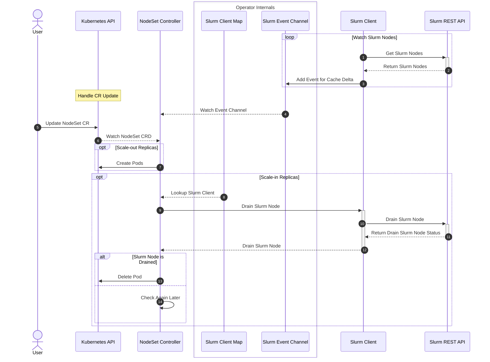

# NodeSet Controller

## Table of Contents

<!-- mdformat-toc start --slug=github --no-anchors --maxlevel=6 --minlevel=1 -->

- [NodeSet Controller](#nodeset-controller)
  - [Table of Contents](#table-of-contents)
  - [Overview](#overview)
  - [Design](#design)
    - [Sequence Diagram](#sequence-diagram)
  - [Drain and Cordon](#drain-and-cordon)
    - [Kubernetes to Slurm (K8s → Slurm)](#kubernetes-to-slurm-k8s--slurm)
    - [Slurm to Kubernetes (Slurm → K8s)](#slurm-to-kubernetes-slurm--k8s)
    - [Priority](#priority)
    - [Loop Prevention](#loop-prevention)
  - [Well-Known Annotations](#well-known-annotations)
    - [Pod Annotations](#pod-annotations)
    - [Node Annotations](#node-annotations)

<!-- mdformat-toc end -->

## Overview

The nodeset controller is responsible for managing and reconciling the NodeSet
CRD, which represents a set of homogeneous Slurm Nodes.

## Design

This controller is responsible for managing and reconciling the NodeSet CRD. In
addition to the regular responsibility of managing resources in Kubernetes via
the Kubernetes API, this controller should take into consideration the state of
Slurm to make certain reconciliation decisions.

### Sequence Diagram

## Drain and Cordon

The NodeSet controller synchronizes drain state **bidirectionally** between
Kubernetes and Slurm. Draining a node on either side is reflected on the other.

### Kubernetes to Slurm (K8s → Slurm)

When a Kubernetes node is cordoned (`kubectl cordon <node>`), the NodeSet
controller:

1. Sets the `nodeset.slinky.slurm.net/pod-cordon: "true"` annotation on each
   NodeSet pod running on that node.
2. Sets `nodeset.slinky.slurm.net/pod-cordon-source: "operator"` to record that
   the cordon originated from the Kubernetes side.
3. Drains the corresponding Slurm node via the Slurm REST API, prefixing the
   reason with `slurm-operator:`.

When the Kubernetes node is uncordoned, the pod annotation is removed and the
Slurm node is undrained.

The same flow applies when the `pod-cordon` annotation is set directly on a
NodeSet pod (e.g. for targeted draining of a single Slurm node).

A custom drain reason can be provided by setting the
`nodeset.slinky.slurm.net/node-cordon-reason` annotation on the Kubernetes
node before cordoning it.

### Slurm to Kubernetes (Slurm → K8s)

When a Slurm node is drained externally (e.g. via `scontrol update
node=<name> state=drain reason="maintenance"`), the NodeSet controller detects
this during its periodic reconciliation and:

1. Sets `nodeset.slinky.slurm.net/pod-cordon: "true"` on the corresponding
   pod.
2. Sets `nodeset.slinky.slurm.net/pod-cordon-source: "slurm"` to record that
   the cordon originated from the Slurm side.
3. Sets `nodeset.slinky.slurm.net/pod-cordon-reason` to the Slurm node's
   drain reason, making it visible from `kubectl describe pod`.

When the Slurm node is undrained externally, the controller removes all three
annotations from the pod.

The operator distinguishes external drains from its own by checking the Slurm
node reason prefix (`slurm-operator:`). Drains that do not carry this prefix
are treated as externally initiated.

### Priority

The Kubernetes node cordon state has **higher priority** than the Slurm drain
state. If a Kubernetes node is cordoned, the operator will **always** drain the
corresponding Slurm node on every reconciliation. This means that running
`scontrol update node=<name> state=resume` while the Kubernetes node is still
cordoned has **no lasting effect** — the operator will re-drain the Slurm node
on the next reconciliation cycle.

To fully undrain a node that was cordoned from the Kubernetes side, you must
uncordon the Kubernetes node first (`kubectl uncordon <node>`). Only then will
the operator allow the Slurm node to remain in an idle/resume state.

Conversely, an external Slurm drain (`scontrol update node=<name> state=drain`)
is reflected on the Kubernetes side as a pod annotation but does **not** cordon
the Kubernetes node itself. The Slurm drain can be lifted independently via
`scontrol update node=<name> state=resume`, and the operator will remove the pod
annotations accordingly.

### Loop Prevention

A bidirectional sync must avoid infinite loops where each side re-triggers the
other. The operator prevents this using the `pod-cordon-source` annotation:

- When the controller sets `pod-cordon` because of a Kubernetes node cordon, it
  also sets `pod-cordon-source: "operator"`.
- When the controller sets `pod-cordon` because of an external Slurm drain, it
  also sets `pod-cordon-source: "slurm"`.
- On subsequent reconciles, if the pod is cordoned with source `"slurm"`, the
  controller does **not** issue a drain command to Slurm (the node is already
  drained).
- If the Slurm node is later undrained, the controller detects the state change
  and removes the pod annotations.
- Cordons with source `"operator"` take priority: the operator will re-drain the
  Slurm node on every reconciliation as long as the Kubernetes node stays
  cordoned, regardless of any `scontrol` undrain attempts.

## Well-Known Annotations

### Pod Annotations

| Annotation | Value | Description |
|---|---|---|
| `nodeset.slinky.slurm.net/pod-cordon` | `"true"` | Marks the pod for Slurm node drain. When set, the corresponding Slurm node is drained (or already drained, in the Slurm → K8s direction). |
| `nodeset.slinky.slurm.net/pod-cordon-source` | `"operator"` or `"slurm"` | Indicates the origin of the cordon. `"operator"` means the cordon was initiated from a Kubernetes node cordon (higher priority). `"slurm"` means it was initiated from an external Slurm drain and prevents the operator from re-draining the Slurm node. |
| `nodeset.slinky.slurm.net/pod-cordon-reason` | string | The Slurm node drain reason, stored when the cordon originates from an external Slurm drain. |
| `nodeset.slinky.slurm.net/pod-deletion-cost` | integer | Influences pod deletion order during scale-in. Lower cost pods are deleted first. |
| `nodeset.slinky.slurm.net/pod-deadline` | RFC 3339 timestamp | Indicates when the Slurm node's running workload is expected to complete. Earlier deadlines are preferred for deletion. |

### Node Annotations

| Annotation | Value | Description |
|---|---|---|
| `nodeset.slinky.slurm.net/node-cordon-reason` | string | When set on a Kubernetes node before cordoning, overrides the default Slurm drain reason used by the operator. |
| `topology.slinky.slurm.net/line` | string | The Slurm dynamic topology line (e.g. `"topo-switch:s2,topo-block:b2"`). See [Topology](../usage/topology.md). |
